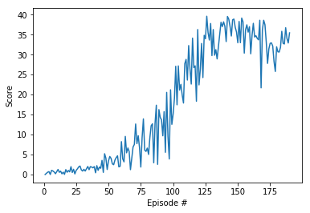

# Deep RL Nanodegree - Report for Project 2
In this project, an agent is trained in the [Reacher](https://github.com/Unity-Technologies/ml-agents/blob/master/docs/Learning-Environment-Examples.md#reacher) environment. The goal is to move a double-jointed arm to target locations by  predicting the torque for each of the joints. 

## Learning Algorithm
In order to solve this problem, [DDPG](https://arxiv.org/abs/1509.02971) is used. DDPG is an adaptation of the successful Deep Q-Learning [DQN](https://storage.googleapis.com/deepmind-media/dqn/DQNNaturePaper.pdf) to the continuous action domain. The algorithm is model-free and based on the [deterministic policy gradient](http://proceedings.mlr.press/v32/silver14.pdf); it leverages a actor-critic setup and is designed for continuous action spaces. 

## Network Architechture
The actor and critic are both represented as fully-connected neural networks. 

The network for the actor consists of a 33-dimensional input layer corresponding to the state size, two hidden layers with 400 and 300 nodes and a 4-dimensional output layer corresponding to the action size.

The network for the critic consists of a 33-dimensional input layer corresponding to the state size, three hidden layers with 256, 256 and 64 nodes and a 1-dimensional output layer corresponding to the Q-value prediction. The action is added as input at the first hidden layer by concatenation.


## Training Details
The following hyper-parameters were used. 

```python
BUFFER_SIZE = int(1e6)  # replay buffer size
BATCH_SIZE = 1024       # minibatch size
GAMMA = 0.99            # discount factor
TAU = 1e-3              # for soft update of target parameters
LR_ACTOR = 1e-3         # learning rate of the actor 
LR_CRITIC = 1e-3        # learning rate of the critic
WEIGHT_DECAY = 0.0      # L2 weight decay
UPDATE_STEP = 4         # Step size for updating the networks
```

## Plot of Rewards


Environment solved in 90 episodes!	Average Score: 30.12

## Importance of Exploration
Initially, it was very difficult to achieve a score above 1 regardless of network architecture and hyper-parameters. It turns out that the OpenAI Gym implementation of DDPG which was used as a baseline had a bug in the implementation of the [Ornstein–Uhlenbeck process](https://en.wikipedia.org/wiki/Ornstein%E2%80%93Uhlenbeck_process). Good exploration is probably the most important factor to training a successful agent.  It is crucial to have a lot of exploration in the beginning and less exploration when the agent has learned a good policy. To this end, a schedule was implemented to either sample an action from the noise process or the learned policy depending on the progress of training. In particular, the exploration probability is: 
```python
p = np.clip(1 - np.sqrt(i_episode/n_episodes), 0, 1) 
```
Based on this probability, exploration noise can be added in two different ways, *fuse* or *threshold*.  In the option *fuse* the exploration noise is fused with an action from the policy proportional to the probability. In the option *threshold* the action is chosen either from the policy or the noise process using the probability as a threshold. In the experiments both approaches yield similar results. The implementation is shown below.
```python
if noise_apply == 'fuse':
    if noise_type == 'ou':
        action = (1-noise_prob) * action + (noise_prob) * self.ou_noise.sample()
    elif noise_type == 'uni':
        action = (1-noise_prob) * action + (noise_prob) * self.uni_noise.sample()
elif noise_apply == 'threshold':
    if noise_type == 'ou' and noise_prob > random.random():
        action = self.ou_noise.sample()
    elif noise_type == 'uni' and noise_prob > random.random():
        action = self.uni_noise.sample() 
```

## Future Work
### Improved version of DDPG

When training the the agent, it became apparent that it is quite sensitive to the network architecture (actor and critic) and training parameters. While the current agent learns to solve the task quite quickly, further performance boost could certainly be achieved by further hyper-parameter tuning. 

Also [prioritized experience replay](https://arxiv.org/abs/1511.05952) could help to further boost performance. In conventional DDPG experiences are samples from the replay memory proportial to the frequency they occured. Priority experience replay, as the name suggests, prioritizes experiences containing important transitions and samples them more frequently. This leads to more effienct training.

### Crawler Environment

It would be a nice challenge to solve the more difficult **Crawler** environment.


In this continuous control environment, the goal is to teach a creature with four legs to walk forward without falling.  

You can read more about this environment in the ML-Agents GitHub [here](https://github.com/Unity-Technologies/ml-agents/blob/master/docs/Learning-Environment-Examples.md#crawler).  To solve this harder task, you'll need to download a new Unity environment.  (**Note**: Udacity students should not submit a project with this new environment.)

You need only select the environment that matches your operating system:
- Linux: [click here](https://s3-us-west-1.amazonaws.com/udacity-drlnd/P2/Crawler/Crawler_Linux.zip)
- Mac OSX: [click here](https://s3-us-west-1.amazonaws.com/udacity-drlnd/P2/Crawler/Crawler.app.zip)
- Windows (32-bit): [click here](https://s3-us-west-1.amazonaws.com/udacity-drlnd/P2/Crawler/Crawler_Windows_x86.zip)
- Windows (64-bit): [click here](https://s3-us-west-1.amazonaws.com/udacity-drlnd/P2/Crawler/Crawler_Windows_x86_64.zip)

Then, place the file in the root folder of the repository, and unzip (or decompress) the file.  Next, open `Crawler.ipynb` and follow the instructions to learn how to use the Python API to control the agent.

(_For AWS_) If you'd like to train the agent on AWS (and have not [enabled a virtual screen](https://github.com/Unity-Technologies/ml-agents/blob/master/docs/Training-on-Amazon-Web-Service.md)), then please use [this link](https://s3-us-west-1.amazonaws.com/udacity-drlnd/P2/Crawler/Crawler_Linux_NoVis.zip) to obtain the "headless" version of the environment.  You will **not** be able to watch the agent without enabling a virtual screen, but you will be able to train the agent.  (_To watch the agent, you should follow the instructions to [enable a virtual screen](https://github.com/Unity-Technologies/ml-agents/blob/master/docs/Training-on-Amazon-Web-Service.md), and then download the environment for the **Linux** operating system above._)
